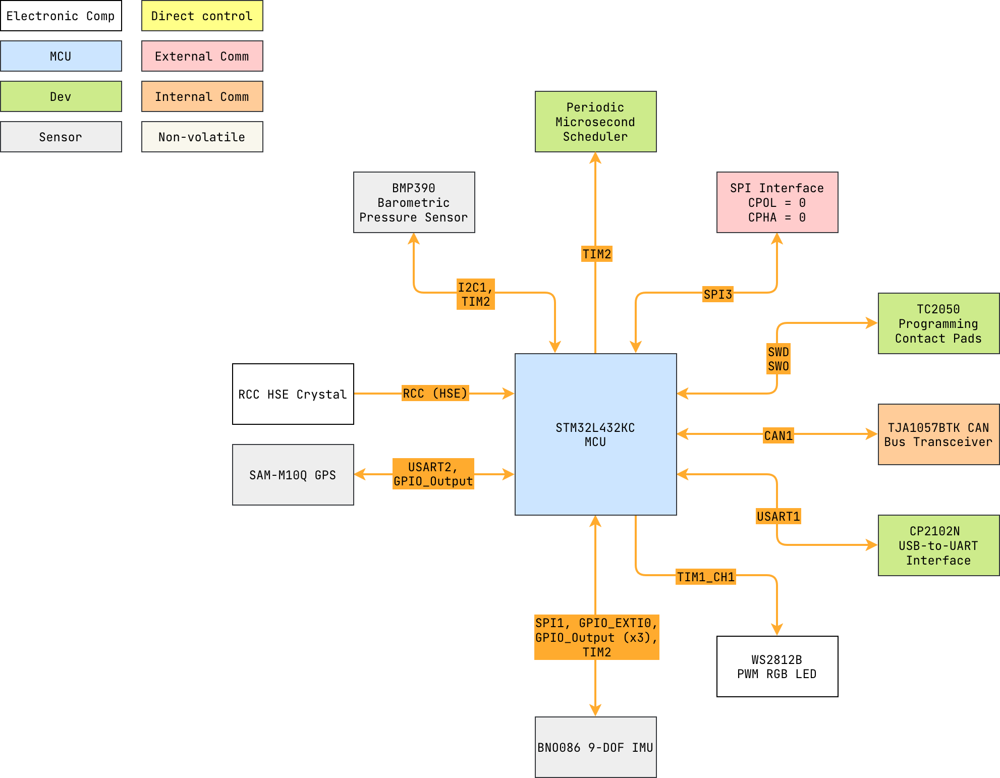

# momentum


Microcontroller firmware
for [`momentum_pcb`](https://github.com/danielljeon/momentum_pcb).

- SPI sensor hub compatible with Uno-style microcontroller boards.

---

<details markdown="1">
  <summary>Table of Contents</summary>

<!-- TOC -->
* [momentum](#momentum)
  * [1 Overview](#1-overview)
    * [1.1 Bill of Materials (BOM)](#11-bill-of-materials-bom)
    * [1.2 Block Diagram](#12-block-diagram)
    * [1.3 Pin Configurations](#13-pin-configurations)
    * [1.4 Clock Configurations](#14-clock-configurations)
  * [2 USB Interface via CP2102N (USB-to-UART)](#2-usb-interface-via-cp2102n-usb-to-uart)
    * [2.1 Data Line Activity LEDs](#21-data-line-activity-leds)
  * [3 Serial Peripheral Interface (SPI)](#3-serial-peripheral-interface-spi)
<!-- TOC -->

</details>

---

## 1 Overview

### 1.1 Bill of Materials (BOM)

| Manufacturer Part Number | Manufacturer            | Description                       | Quantity | Notes |
|--------------------------|-------------------------|-----------------------------------|---------:|-------|
| STM32L432KC              | STMicroelectronics      | 32-bit MCU                        |        1 |       |
| CP2102N-A02-GQFN24R      | Silicon Labs            | USB 2.0 to UART Interface         |        1 |       |
| BNO085                   | CEVA Technologies, Inc. | 9-DOF IMU                         |        1 |       |
| BMP390                   | Bosch Sensortec         | Barometric Pressure Sensor        |        1 |       |
| TJA1051T/3               | NXP USA Inc.            | CAN Bus Transceiver               |        1 |       |
| SAM-M10Q                 | u-blox                  | RF Receiver Galileo, GLONASS, GPS |        1 |       |
| WS2812B                  | (Various)               | PWM Addressable RGB LED           |        1 |       |

### 1.2 Block Diagram



> Drawio file here: [momentum.drawio](docs/momentum.drawio).

### 1.3 Pin Configurations

<details markdown="1">
  <summary>CubeMX Pinout</summary>


</details>

<details markdown="1">
  <summary>Pin & Peripherals Table</summary>

| STM32F446RE | Peripheral              | Config                           | Connection                       | Notes                                           |
|-------------|-------------------------|----------------------------------|----------------------------------|-------------------------------------------------|
| PA14        | `SYS_JTCK-SWCLK`        |                                  | TC2050 SWD Pin 4: `SWCLK`        |                                                 |
| PA13        | `SYS_JTMS-SWDIO`        |                                  | TC2050 SWD Pin 2: `SWDIO`        |                                                 |
|             | `TIM2_CH1`              | PWM no output                    |                                  | BMP390 BMP3 driver timer.                       |
|             | `TIM2_CH2`              | PWM no output                    |                                  | BNO085 SH2 driver timer.                        |
| PA5         | `SPI1_SCK`              |                                  | BNO085 Pin 19: `H_SCL/SCK/RX`    |                                                 |
| PA4         | `GPIO_Output` (SPI1 CS) | Set high                         | BNO085 Pin 18: `H_CSN`           |                                                 |
| PA6         | `SPI1_MISO`             |                                  | BNO085 Pin 20: `H_SDA/H_MISO/TX` |                                                 |
| PA7         | `SPI1_MOSI`             |                                  | BNO085 Pin 17: `SA0/H_MOSI`      |                                                 |
| PB0         | `GPIO_EXTI0`            | Pull-up, falling edge            | BNO085 Pin 14: `H_INTN`          |                                                 |
| PB1         | `GPIO_Output`           | Set high                         | BNO085 Pin 6: `PS0/Wake`         | Pull low to trigger wake.                       |
|             |                         | Hardware pull-up                 | BNO085 Pin 5: `PS1`              |                                                 |
| PA1         | `GPIO_Output`           | Set high                         | BNO085 Pin 11: `NRST`            | Pull low to reset.                              |
| PB6         | `I2C1_SCL`              |                                  | BMP390 Pin 2: `SCK`              |                                                 |
| PB7         | `I2C1_SDA`              |                                  | BMP390 Pin 4: `SDI`              |                                                 |
| PA3         | `USART2_RX`             | 9600 bps (-> 115200 in software) | SAM-M10Q Pin 13: `TXD`           | Starts as 9600 bps to match the u-blox default. |
| PA2         | `USART2_TX`             | 9600 bps (-> 115200 in software) | SAM-M10Q Pin 14: `RXD`           | Starts as 9600 bps to match the u-blox default. |
| PC15        | `GPIO_Output`           |                                  | SAM-M10Q Pin 18: `RESET_N`       | Pull low to reset (>= 1 ms).                    |
| PA10        | `USART1_RX`             | 115200 bps                       | CP2102N-A02-GQFN24R Pin 20: TXD  |                                                 |
| PA9         | `USART1_TX`             | 115200 bps                       | CP2102N-A02-GQFN24R Pin 21: RXD  |                                                 |
| PA11        | `CAN1_RX`               |                                  | TJA1051T/3 Pin 1: `TXD`          |                                                 |
| PA12        | `CAN1_TX`               |                                  | TJA1051T/3 Pin 4: `RXD`          |                                                 |
| PA8         | `TIM1_CH1`              | PWM Generation CH1               | WS2812B Pin: `DIN`               | DIN pin number depends on IC variant.           |
| PB3         | `SPI3_SCK`              |                                  | SPI interface: `SCK`             |                                                 |
| PBA15       | `SPI3_NSS`              | Pull-up, set high                | SPI interface: `SS`              |                                                 |
| PB4         | `SPI3_MISO`             |                                  | SPI interface: `MISO`            |                                                 |
| PB5         | `SPI3_MOSI`             |                                  | SPI interface: `MOSI`            |                                                 |

</details>

### 1.4 Clock Configurations

```
8 MHz High Speed External (HSE)
↓
Phase-Locked Loop Main (PLLM)
↓
80 MHz SYSCLK
↓
80 MHz HCLK
↓
 → 80 MHz APB1 (Maxed) → 80 MHz APB1 Timer
 → 80 MHz APB2 (Maxed) → 80 MHz APB2 Timer
```

---

## 2 USB Interface via CP2102N (USB-to-UART)

Utilizing the USB interface via the CP2102N requires Silicon
Labs's [VCP CP210x USB to UART Bridge VCP Drivers](https://www.silabs.com/developer-tools/usb-to-uart-bridge-vcp-drivers).

### 2.1 Data Line Activity LEDs

Direct from the manufacturer/suppliers the CP2102N's LED GPIOs are not enabled.
To enable the LED GPIOs, the CP2102N undergoes additional configuration
programming via Silicon
Labs's [Simplicity Studio Software](https://www.silabs.com/developer-tools/simplicity-studio).


`GPIO0` and `GPIO1`'s `Alternative Function` need to be configured as
`TX Toggle` and `RX Toggle` respectively as shown in the picture above.

---

## 3 Serial Peripheral Interface (SPI)

SPI configurations:

- CPOL = 0.
- CPHA = 0.
- Hardware peripheral select (NSS) enabled.

Low level SPI communication drivers can be found
here: [momentum_driver](https://github.com/danielljeon/momentum_driver).
